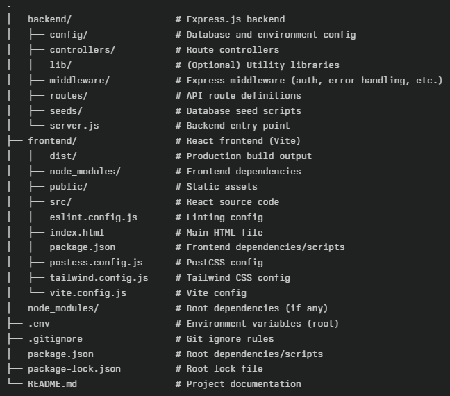
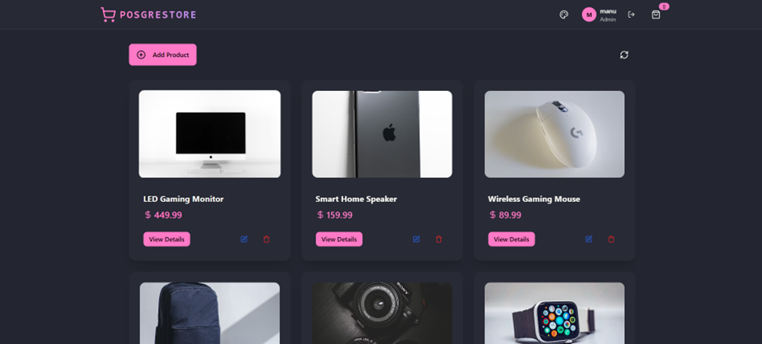
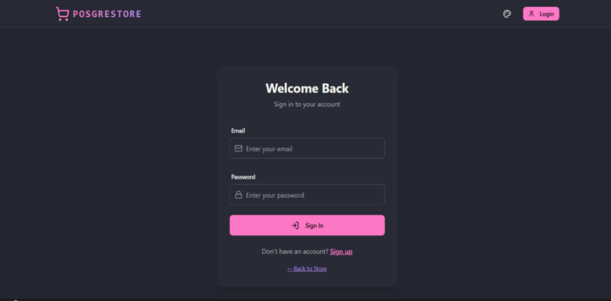
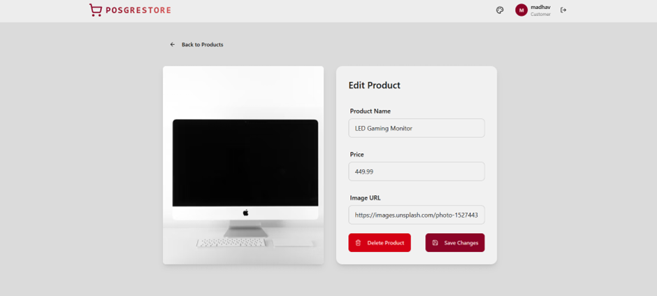

# 🛍️ PERN Stack Product Management Web App

A modern, responsive Product Management Web App platform built with the PERN stack (PostgreSQL, Express.js, React, Node.js).  
Features user authentication, product management, and a sleek, professional UI.
Deployed link:  

---

## ✨ Features

- **🔒 Secure User Authentication:** Register, login, and logout with JWT and HTTP-only cookies.
- **👥 Role-Based Access:** Admins can add, edit, and delete products; customers can browse products.
- **📦 Product Management:** View, add, edit, and delete products.
- **📱 Responsive Design:** Works seamlessly on all devices.
- **🛡️ Security:** Password salting and hashing with bcryptjs.

---

## 🛠️ Tech Stack

| Layer      | Technology/Library         |
|------------|---------------------------|
| Frontend   | React, Vite, Tailwind CSS, DaisyUI |
| Backend    | Node.js, Express.js       |
| Database   | PostgreSQL (Neon)         |
| Auth       | JWT, HTTP-only cookies, bcryptjs |
| Routing    | React Router              |
| State      | Zustand                   |

---

## 📂 Project Structure




## 🚀 Installation

1. **Clone the repository:**
git clone https://github.com/MrinalManu1/Product_Management_Web_App
cd posgrestore

text

2. **Install dependencies:**
npm install
cd frontend
npm install
cd ..

text

3. **Set up environment variables:**
- Create a `.env` file in the `backend` folder with:
  ```
  JWT_SECRET=your-very-strong-secret-key
  DATABASE_URL=your-neon-postgres-connection-string
  ```

4. **Seed the database (optional):**
cd backend
npm run seed

text

5. **Start the servers:**
- **Backend:**
  ```
  npm run dev
  ```
- **Frontend:**
  ```
  cd frontend
  npm run dev
  ```

---

## 🖼️ Screenshots



*Homepage of the Product_Management_Web_App *

 

*User login screen*




*Admin product management interface*


---

## 📝 Notes

- **Authentication:** Uses JWT stored in HTTP-only cookies for security.
- **Database:** PostgreSQL hosted on Neon. Change the connection string in `.env` for your own database.
- **Seeding:** Run `npm run seed` in the `backend` folder to populate the database with sample products.

---

## 🤝 Contributing

Pull requests are welcome! For major changes, please open an issue first.


